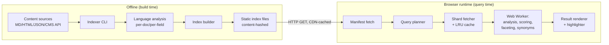

# Architecture

## Components

## Offline: the Indexer

A Node.js CLI (`csf build`) that:

1. **Ingests** documents via pluggable source adapters (rendered-HTML
   crawl/build-output — the recommended default, see
   [14-reference-deployment-cms-2k.md](14-reference-deployment-cms-2k.md#ingestion-from-rendered-html) —
   plus filesystem glob, JSON feed, or headless CMS API for cases that
   need structured fields HTML doesn't expose). Each adapter yields a
   normalized `RawDocument { id, url, fields: Record<string, FieldValue>, language?, boost? }`.
2. **Detects/validates language** per document (explicit `language` field
   wins; otherwise a lightweight n-gram detector runs, e.g. a trained
   fastText/franc-style model) since analysis is language-specific.
3. **Analyzes** each text field with the language's tokenizer/stemmer/
   stopword pipeline (see [03-tokenization-i18n.md](03-tokenization-i18n.md)),
   producing per-field token streams with positions.
4. **Builds**:
   - an inverted index (term → postings) partitioned by language and
     sharded by term prefix,
   - a facet index (field/value → doc ids, plus precomputed counts),
   - a compact document store (fields needed to render a result: title,
     url, excerpt source, thumbnail — *not* full body text),
   - a manifest describing shard boundaries, checksums, field schema,
     languages present, and build metadata.
5. **Emits** everything under `dist/index/` as immutable,
   content-hash-named files (`terms.en.3f9a.json`, `manifest.a91c.json`, …)
   suitable for `Cache-Control: immutable, max-age=31536000`.

The indexer runs in CI on every content change; the emitted directory is
the deployment artifact (uploaded to whatever static host serves the
site).

## Runtime: the Query Engine

Ships as an ES module, split into a small **core** plus **plugins** that
are only pulled in if configured (so a single-language, no-fuzzy,
no-synonyms deployment stays minimal). The full plugin contract — hook
points, registration, capability negotiation, versioning — is specified
in [17-plugin-architecture.md](17-plugin-architecture.md); this section
just lists what ships as which module:

- `core`: manifest loading, shard fetch + cache, boolean query
  evaluation, BM25F scoring, result assembly. ~10-15KB gzipped target.
- `plugin:fuzzy` — typo-tolerant matching (SymSpell-style).
- `plugin:synonyms` — synonym expansion.
- `plugin:facets` — facet index handling (many deployments have none).
- `plugin:lang-<code>` — per-language stemmer/segmenter (e.g.
  `lang-ja` pulls in a CJK segmenter that would otherwise bloat the core).
- `plugin:highlight` — snippet extraction and match highlighting.

All heavy computation (scoring, fuzzy matching, facet aggregation) runs
inside a **Web Worker** so keystroke-driven search never blocks the main
thread; the main-thread client is a thin postMessage/Comlink-style proxy
with the same async API whether or not a worker is used (fallback to
same-thread execution when Workers are unavailable, e.g. some SSR/test
environments).

## Data flow for a query

1. App calls `client.search("query text", { filters, facets, language })`.
2. Core has already fetched the **manifest** (once, at client init) —
   small file listing shard hashes, field weights, available languages.
3. Query planner tokenizes the query text using the *same* analysis
   pipeline as indexing (critical for correctness — see
   [03-tokenization-i18n.md](03-tokenization-i18n.md)), determines query
   language (explicit or detected), expands synonyms, and computes which
   term shards are needed.
4. Shard fetcher requests only those shards (parallel HTTP GET, browser
   HTTP cache + in-memory LRU dedupe across queries), decompresses
   (`Content-Encoding: br` handled by the browser transparently).
5. Worker merges postings, applies boosts, computes BM25F scores, applies
   filters/facets, sorts, takes top-N.
6. Doc store entries for only the top-N result ids are fetched (separate
   small shard) to render title/url/excerpt — the bulk of stored content
   never has to hit the client unless it's an actual hit.
7. Highlighter generates snippets from stored excerpt + match positions.
8. Results streamed back to the app as they become available (cheap
   "instant" results first, refined results — e.g. fuzzy fallback — as a
   follow-up event) rather than a single blocking promise, though a plain
   `await client.search(...)` is also supported for simple use.

## Deployment topology

- Index files live alongside (or in a subpath of) the site/app being
  searched, or on a separate static bucket/CDN — the client is configured
  with a base URL and has no other coupling to the site's backend.
- Multiple independent indexes can be composed client-side (federated
  search across e.g. docs + blog + API reference) by querying multiple
  manifests and merging ranked results, since there's no shared server to
  do that merge for you.
- Rebuilds are just re-running the indexer and re-uploading; old and new
  shard sets can coexist (content-hashed names) so there's no
  cache-invalidation race — the manifest is the single mutable pointer,
  fetched with `Cache-Control: no-cache` (or short max-age) while shards
  are immutable.
